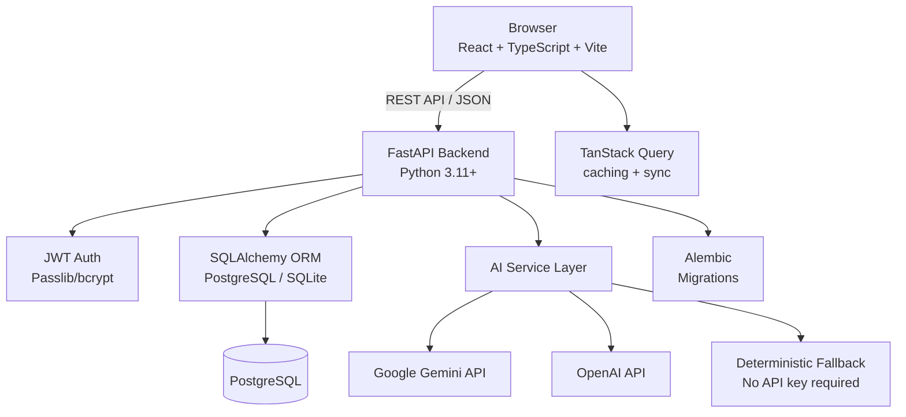

# LeadForge AI

> **AI-Powered CRM & Sales Pipeline Management Platform**

A production-quality, full-stack SaaS CRM built with FastAPI, React, PostgreSQL, and AI-powered lead intelligence. Designed to demonstrate senior-level full-stack engineering across the complete technology stack.

## Architecture



## Features

### Core CRM
- **Lead Management** — Full CRUD, search, filtering, pagination, status tracking
- **Sales Pipeline** — Kanban-style pipeline with 7 stages (New → Won/Lost)
- **Company Management** — Company profiles with contacts, leads, activities
- **Contact Management** — Contacts linked to companies
- **Opportunity Tracking** — Pipeline value, weighted pipeline, win rate calculations
- **Task Management** — Tasks with due dates, priorities, overdue detection
- **Activity Timeline** — Chronological history of calls, emails, meetings, demos

### AI Features
- **Lead Scoring** — 0-100 score with HOT/WARM/COLD classification
- **Lead Summary** — AI-generated profile summaries with risk assessment
- **Email Generator** — Professional follow-up emails (4 types)
- **Sales Insights** — Pipeline bottlenecks, at-risk deals, action items
- **Multi-provider** — Gemini, OpenAI, or deterministic fallback (no API key needed)

### Analytics Dashboard
- KPI cards: leads, pipeline value, won revenue, win rate
- Charts: leads over time, revenue by month, pipeline by stage, lead sources
- Sales rep performance table
- All metrics computed from live database data

### Security & Auth
- JWT authentication with configurable expiry
- Role-based access control (ADMIN, MANAGER, SALES_REP)
- Bcrypt password hashing
- CORS configuration
- Input validation via Pydantic v2

## Tech Stack

| Layer | Technology |
|-------|-----------|
| Frontend | React 18, TypeScript, Vite, Tailwind CSS |
| State Management | TanStack Query v5 |
| Forms | React Hook Form + Zod |
| Charts | Recharts |
| Routing | React Router v7 |
| Backend | FastAPI, Python 3.11+ |
| ORM | SQLAlchemy 2.x |
| Database | PostgreSQL (Docker) / SQLite (local dev) |
| Auth | JWT (python-jose), Passlib/bcrypt |
| Migrations | Alembic |
| AI | Google Gemini / OpenAI / Deterministic fallback |
| Testing | Pytest + HTTPX (backend), Vitest + RTL (frontend) |
| DevOps | Docker, Docker Compose, GitHub Actions CI |

## Project Structure

```
LeadForge AI/
├── backend/
│   ├── app/
│   │   ├── main.py              # FastAPI app, middleware, exception handlers
│   │   ├── core/
│   │   │   ├── config.py        # Settings (pydantic-settings)
│   │   │   └── security.py      # JWT, password hashing, auth deps
│   │   ├── api/v1/endpoints/   # Route handlers (thin, call services)
│   │   ├── models/             # SQLAlchemy models (13 tables)
│   │   ├── schemas/            # Pydantic v2 schemas
│   │   ├── services/           # Business logic layer
│   │   ├── ai/                 # AI service abstraction
│   │   │   ├── base.py         # Abstract base class
│   │   │   ├── fallback.py     # Deterministic rule-based engine
│   │   │   ├── gemini_service.py
│   │   │   └── factory.py      # Provider selection
│   │   └── db/database.py      # SQLAlchemy engine + session
│   ├── tests/                  # Pytest test suite (40 tests)
│   ├── alembic/                # Database migrations
│   ├── seed.py                 # Demo data seeder
│   └── requirements.txt
├── frontend/
│   ├── src/
│   │   ├── api/                # Typed API client layer
│   │   ├── components/ui/      # Reusable component library
│   │   ├── context/            # React contexts (Auth)
│   │   ├── features/           # Feature-specific forms
│   │   ├── hooks/              # Custom React hooks
│   │   ├── layouts/            # App layout, Auth layout
│   │   ├── pages/              # Route-level page components
│   │   ├── router/             # React Router configuration
│   │   ├── types/              # TypeScript type definitions
│   │   └── utils/              # Formatters, constants
│   └── package.json
├── .github/workflows/ci.yml    # GitHub Actions CI
├── docker-compose.yml
└── README.md
```

## Database Schema

```
User (id, email, hashed_password, first_name, last_name, role, is_active)
  └── owns many Leads, Opportunities, Tasks

Company (id, name, industry, website, size, location, annual_revenue)
  ├── has many Contacts
  └── has many Leads

Contact (id, first_name, last_name, email, phone, job_title, company_id)

Lead (id, first_name, last_name, email, phone, company, job_title, source,
      industry, company_size, location, estimated_value, status, priority,
      score, score_label, owner_id, company_id)
  ├── has one Opportunity
  ├── has many Activities
  ├── has many Notes
  ├── has many Tasks
  └── has many AIAnalyses

Pipeline (id, name, is_default)
  └── has many PipelineStages

PipelineStage (id, name, order, color, probability, pipeline_id)
  └── has many Opportunities

Opportunity (id, title, value, probability, status, expected_close_date,
             lead_id, pipeline_id, stage_id, owner_id, company_id)

Task (id, title, description, due_date, status, priority,
      assigned_to_id, lead_id, opportunity_id)

Activity (id, type, title, description, outcome, user_id, lead_id, company_id)

Note (id, content, author_id, lead_id, company_id)

AIAnalysis (id, analysis_type, provider, score, result_data, lead_id)

Notification (id, title, message, type, is_read, user_id)
```

## Quick Start (Local Development)

### Prerequisites
- Python 3.9+
- Node.js 18+
- (Optional) PostgreSQL or Docker

### 1. Clone and setup

```bash
git clone https://github.com/your-username/LeadForge-AI.git
cd "LeadForge AI"
```

### 2. Backend Setup

```bash
cd backend

# Create virtual environment
python3 -m venv venv
source venv/bin/activate  # Windows: venv\Scripts\activate

# Install dependencies
pip install -r requirements.txt
pip install bcrypt==4.0.1  # Ensure bcrypt compatibility

# Configure environment
cp .env.example .env
# Edit .env - default uses SQLite (no Postgres needed!)

# Seed demo data
python seed.py

# Start backend
uvicorn app.main:app --reload --port 8000
```

Backend runs at: http://localhost:8000  
API Docs (Swagger): http://localhost:8000/docs  
ReDoc: http://localhost:8000/redoc

### 3. Frontend Setup

```bash
cd frontend

# Install dependencies
npm install

# Configure environment
cp .env.example .env
# VITE_API_BASE_URL=http://localhost:8000

# Start frontend dev server
npm run dev
```

Frontend runs at: http://localhost:5173

## Demo Credentials

| Role | Email | Password |
|------|-------|----------|
| **Admin** | admin@leadforge.ai | Admin@123456 |
| **Manager** | manager@leadforge.ai | Manager@123456 |
| **Sales Rep** | sarah.chen@leadforge.ai | Sales@123456 |
| **Sales Rep** | marcus.johnson@leadforge.ai | Sales@123456 |

## Docker

### Run everything with Docker Compose

```bash
# Start all services (postgres, backend, frontend)
docker compose up --build

# Access:
# Frontend:  http://localhost:3000
# Backend:   http://localhost:8000
# API Docs:  http://localhost:8000/docs

# Seed demo data (run after containers start)
docker compose exec backend python seed.py
```

## Environment Variables

### Backend (`backend/.env`)

| Variable | Default | Description |
|----------|---------|-------------|
| `DATABASE_URL` | `sqlite:///./leadforge.db` | Database connection string |
| `JWT_SECRET` | (required) | JWT signing secret (min 32 chars) |
| `JWT_EXPIRE_MINUTES` | `10080` | Token expiry (7 days) |
| `CORS_ORIGINS` | `http://localhost:5173` | Allowed origins |
| `AI_PROVIDER` | `fallback` | `fallback`, `gemini`, or `openai` |
| `GEMINI_API_KEY` | (optional) | Google Gemini API key |
| `OPENAI_API_KEY` | (optional) | OpenAI API key |

### Frontend (`frontend/.env`)

| Variable | Default | Description |
|----------|---------|-------------|
| `VITE_API_BASE_URL` | `http://localhost:8000` | Backend API base URL |

## AI Configuration

The AI system uses a **provider abstraction** with graceful fallback:

```python
# Configure in .env:
AI_PROVIDER=fallback   # No API key, deterministic rule-based engine
AI_PROVIDER=gemini     # Requires GEMINI_API_KEY
AI_PROVIDER=openai     # Requires OPENAI_API_KEY
```

The **fallback engine** always works without any API key and uses:
- Rule-based lead scoring (company size, deal value, source, seniority, etc.)
- Template-based email generation
- Data-driven insights from actual database records

## Database Migrations

```bash
cd backend

# Create migration after model changes
alembic revision --autogenerate -m "description"

# Apply migrations
alembic upgrade head

# Rollback
alembic downgrade -1
```

> **Note:** For local SQLite development, migrations are auto-created on startup. Alembic is primarily used with PostgreSQL.

## Testing

### Backend Tests (40 tests)

```bash
cd backend
python -m pytest tests/ -v --tb=short

# With coverage
python -m pytest tests/ --cov=app --cov-report=html
```

Test coverage:
- Auth: registration, login, JWT validation, protected routes
- Leads: full CRUD, search, filtering, activities, notes
- Dashboard: pipeline value, weighted pipeline, win rate, lead counts
- AI: fallback engine scoring (HOT/WARM/COLD), email types, insights

### Frontend Tests

```bash
cd frontend
npm test
```

## API Overview

| Method | Endpoint | Description |
|--------|----------|-------------|
| POST | `/api/auth/register` | Register new user |
| POST | `/api/auth/login` | Login (returns JWT) |
| GET | `/api/auth/me` | Current user profile |
| GET | `/api/leads` | List leads (paginated, filtered) |
| POST | `/api/leads` | Create lead |
| GET | `/api/leads/{id}` | Get lead details |
| PUT | `/api/leads/{id}` | Update lead |
| DELETE | `/api/leads/{id}` | Delete lead |
| GET | `/api/leads/{id}/activities` | Lead activity history |
| POST | `/api/leads/{id}/activities` | Log activity |
| GET | `/api/companies` | List companies |
| GET | `/api/opportunities` | List opportunities with metrics |
| GET | `/api/pipelines` | Pipeline with stage stats |
| GET | `/api/tasks` | List tasks |
| GET | `/api/dashboard/stats` | KPI statistics |
| GET | `/api/dashboard/charts` | Chart data |
| POST | `/api/ai/leads/{id}/score` | AI lead scoring |
| POST | `/api/ai/leads/{id}/summary` | AI lead summary |
| POST | `/api/ai/leads/{id}/follow-up-email` | Generate email |
| GET | `/api/ai/insights` | Sales pipeline insights |

Full interactive documentation: http://localhost:8000/docs

## Design Decisions

### SQLite for Local Dev + PostgreSQL for Production
The backend auto-detects the database URL and configures SQLAlchemy accordingly. This means you can run the full application locally without installing PostgreSQL.

### AI Provider Abstraction
All AI features go through `BaseAIService`. Adding a new provider (e.g., Anthropic Claude) requires only implementing the 4 abstract methods. The fallback engine ensures the product works without any API key.

### Service Layer Architecture
Routes are kept thin — they only handle HTTP concerns. Business logic lives in the service layer (`auth_service`, `lead_service`, `dashboard_service`). This makes testing straightforward.

### Server-Side Pagination
Lead and opportunity lists use server-side pagination to avoid loading full datasets to the client. The backend returns `total`, `page`, `total_pages` alongside data.

### Role-Based Access Control
RBAC is enforced on the backend using dependency injection (`require_roles()` decorator). Frontend hides UI elements based on role, but backend always validates permissions independently.

## Known Limitations

1. **No real-time updates** — WebSocket/SSE not implemented; data refreshes on TanStack Query cache invalidation
2. **Email sending** — AI generates email content but does not send emails (by design)
3. **File uploads** — No attachment support
4. **Multi-tenancy** — Single-tenant; all users share data (team CRM model)
5. **No OAuth** — Username/password only; SSO not implemented

## Future Improvements

- [ ] WebSocket for real-time pipeline updates
- [ ] Email integration (SendGrid/SES)
- [ ] Bulk lead import (CSV/Excel)
- [ ] Advanced reporting with date range filters
- [ ] Zapier/webhook integrations
- [ ] Multi-language support (i18n)
- [ ] Dark mode
- [ ] Mobile app (React Native)

## License

MIT License — see [LICENSE](LICENSE)

---

Built with ❤️ as a demonstration of production full-stack engineering.
